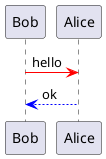
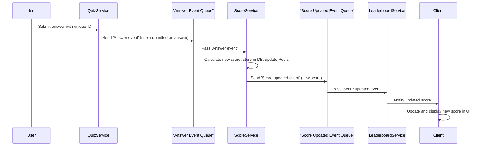

### Test 

```plantuml
@startuml
Bob -[#red]> Alice : hello
Alice -[#0000FF]->Bob : ok
@enduml
```

```mermaid
sequenceDiagram
        participant User
    participant QuizService
    participant MessageQueue1 as "Answer Event Queue"
    participant ScoreService
    participant MessageQueue2 as "Score Updated Event Queue"
    participant LeaderboardService
    participant Client

    User->>QuizService: Submit answer with unique ID
    QuizService->>MessageQueue1: Send 'Answer event' (user submitted an answer)
    MessageQueue1->>ScoreService: Pass 'Answer event'
    ScoreService->>ScoreService: Calculate new score, store in DB, update Redis
    ScoreService->>MessageQueue2: Send 'Score updated event' (new score)
    MessageQueue2->>LeaderboardService: Pass 'Score updated event'
    LeaderboardService->>Client: Notify updated score
    Client->>Client: Update and display new score in UI
```
